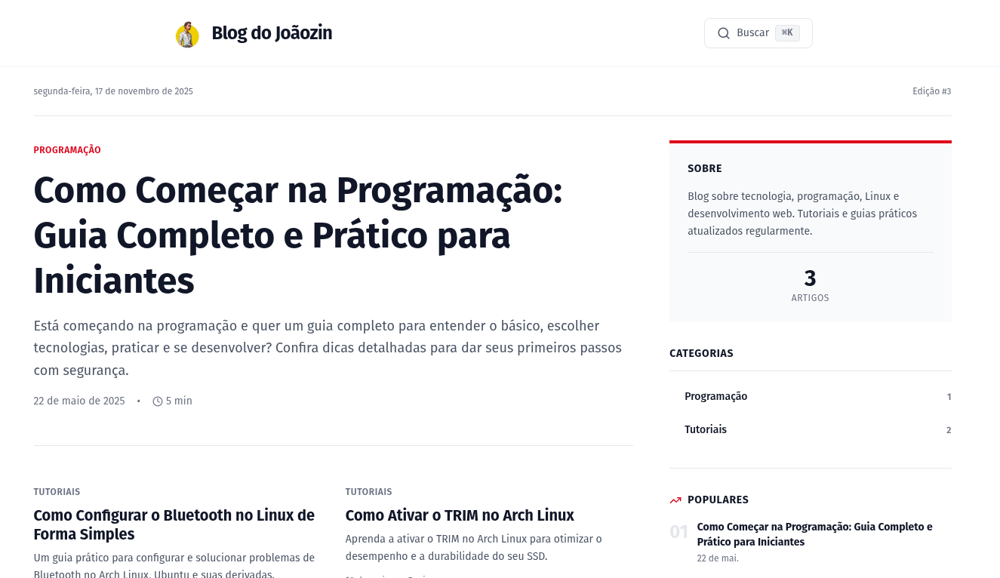

<div align="center">



[](https://nextjs.org/)
[](https://www.typescriptlang.org/)
[](https://tailwindcss.com/)
[](LICENSE)

[Demo ao Vivo](https://blogjoaozinho.vercel.app/) • [Reportar Bug](https://github.com/joaomjbraga/blog-dojoaozinho/issues) • [Solicitar Feature](https://github.com/joaomjbraga/blog-dojoaozinho/issues)

</div>

---

### ✨ Funcionalidades

- 📝 **Sistema de Posts em Markdown** - Escreva seus artigos em Markdown puro
- ⚡ **Performance Otimizada** - Server-side rendering com Next.js 15 App Router
- 🎯 **Type-Safe** - TypeScript em todo o projeto
- 🌐 **Suporte HTML Nativo** - Tabelas, iframes e elementos HTML no Markdown
- 🎬 **Embed de Vídeos** - Suporte nativo para YouTube e outros players
- 📊 **Syntax Highlighting** - Blocos de código com destaque de sintaxe

---

### Pré-requisitos

Certifique-se de ter instalado:

- [Node.js](https://nodejs.org/) 18.17 ou superior
- npm, yarn, pnpm ou bun

### Instalação

```bash
# Clone o repositório
git clone https://github.com/joaomjbraga/blog-dojoaozinho.git

# Entre no diretório
cd blog-dojoaozinho

# Instale as dependências
npm install
# ou
yarn install
# ou
pnpm install

# Inicie o servidor de desenvolvimento
npm run dev

# Acesse em seu navegador
# http://localhost:3000
```

---

## 📁 Estrutura do Projeto

```
blog-dojoaozinho/
├── 📂 src/
│   ├── 📂 app/
│   │   ├── layout.tsx              # Layout raiz da aplicação
│   │   ├── page.tsx                # Página inicial (listagem de posts)
│   │   ├── globals.css             # Estilos globais e customizações
│   │   └── 📂 blog/
│   │       └── 📂 [slug]/
│   │           └── page.tsx        # Renderização dinâmica de posts
│   ├── 📂 components/
│   │   ├── BlogCard.tsx            # Card de preview na listagem
│   │   ├── Header.tsx              # Cabeçalho com navegação
│   │   └── MarkdownRenderer.tsx    # Engine de renderização Markdown
│   └── 📂 lib/
│       └── posts.ts                # Utilitários de leitura/parse de posts
├── 📂 posts/                       # ✍️ Seus artigos em Markdown
│   ├── primeiro-post.md
│   └── segundo-post.md
├── 📂 public/                      # Assets estáticos
├── next.config.ts                  # Configurações do Next.js
├── tailwind.config.js              # Configurações do Tailwind
├── tsconfig.json                   # Configurações do TypeScript
└── package.json
```

---

## ✍️ Criando seu Primeiro Post

### 1. Crie um arquivo Markdown

Adicione um novo arquivo `.md` na pasta `posts/`:

````markdown
---
title: "Meu Primeiro Post Incrível"
date: "2025-05-20"
excerpt: "Uma breve descrição que aparecerá nos cards de preview do blog."
category: "Tutorial"
tags: ["nextjs", "react", "typescript"]
readTime: "5 min"
coverImage: "https://images.unsplash.com/photo-1234567890"
author:
  name: "João M J Braga"
  image: "https://github.com/joaomjbraga.png"
  bio: "Desenvolvedor Full Stack apaixonado por tecnologia"
---

# Bem-vindo ao meu blog!

Este é o conteúdo do post. Você pode usar **negrito**, _itálico_, e muito mais.

## Recursos Suportados

- Listas ordenadas e não-ordenadas
- Links: [GitHub](https://github.com)
- Imagens: 
- Blocos de código
- Tabelas
- E muito mais!

```javascript
// Exemplo de código com syntax highlighting
const bemVindo = () => {
  console.log("Olá, mundo!");
};
```
````

````

### 2. Referência Completa do Frontmatter

| Campo        | Tipo     | Obrigatório | Descrição                                       |
|--------------|----------|-------------|-------------------------------------------------|
| `title`      | `string` | ✅ Sim      | Título principal do post                        |
| `date`       | `string` | ✅ Sim      | Data no formato ISO: `YYYY-MM-DD`               |
| `excerpt`    | `string` | ✅ Sim      | Resumo curto (aparece nos cards)                |
| `category`   | `string` | ✅ Sim      | Categoria principal do artigo                   |
| `tags`       | `array`  | ⚪ Não      | Lista de tags: `["tag1", "tag2"]`               |
| `readTime`   | `string` | ⚪ Não      | Tempo de leitura: `"5 min"`                     |
| `coverImage` | `string` | ⚪ Não      | URL da imagem de capa                           |
| `slug`       | `string` | ⚪ Não      | URL customizada (padrão: nome do arquivo)       |
| `author`     | `object` | ⚪ Não      | Objeto com `name`, `image` e `bio`              |

---

## 🎨 Recursos de Markdown

### Tabelas

```markdown
| Coluna 1 | Coluna 2 | Coluna 3 |
|----------|----------|----------|
| Dado A   | Dado B   | Dado C   |
| Dado D   | Dado E   | Dado F   |
````

### Blocos de Código

````markdown
```typescript
interface Post {
  title: string;
  date: string;
  slug: string;
}

const post: Post = {
  title: "Meu Post",
  date: "2025-05-20",
  slug: "meu-post",
};
```
````

### Embed de Vídeo (YouTube)

```html
<iframe
  width="560"
  height="315"
  src="https://www.youtube.com/embed/dQw4w9WgXcQ"
  title="YouTube video player"
  frameborder="0"
  allow="accelerometer; autoplay; clipboard-write; encrypted-media; gyroscope; picture-in-picture"
  allowfullscreen
>
</iframe>
```

### Citações

```markdown
> "A melhor maneira de prever o futuro é inventá-lo."
> — Alan Kay
```

### Listas

```markdown
- Item não ordenado
- Outro item
  - Subitem indentado

1. Primeiro item ordenado
2. Segundo item
3. Terceiro item
```

---

## 🛠️ Scripts Disponíveis

```bash
# Desenvolvimento com hot-reload
npm run dev

# Build otimizado para produção
npm run build

# Executar build em produção
npm start

# Análise de código e formatação
npm run lint
```

---

## 📦 Stack Tecnológica

| Tecnologia     | Versão | Finalidade                     |
| -------------- | ------ | ------------------------------ |
| Next.js        | 15.x   | Framework React full-stack     |
| React          | 19.x   | Biblioteca de interface        |
| TypeScript     | 5.x    | Tipagem estática               |
| Tailwind CSS   | 3.x    | Framework CSS utilitário       |
| react-markdown | Latest | Parser e renderizador Markdown |
| gray-matter    | Latest | Extração de frontmatter        |
| remark-gfm     | Latest | GitHub Flavored Markdown       |
| rehype-raw     | Latest | Suporte a HTML em Markdown     |

---

## 🎨 Personalização

### Temas e Cores

Edite `src/app/globals.css` para customizar o tema visual:

```css
:root {
  --primary-color: #3b82f6;
  --secondary-color: #8b5cf6;
  --text-color: #1f2937;
  --background: #ffffff;
}
```

### Componentes

Todos os componentes são personalizáveis em `src/components/`:

- **BlogCard.tsx** - Card de preview dos posts
- **Header.tsx** - Cabeçalho e navegação
- **MarkdownRenderer.tsx** - Renderização de Markdown

### Layout

Modifique `src/app/layout.tsx` para ajustar o layout global, metadados e fontes.

---

## 🌐 Deploy

### Vercel (Recomendado)

[](https://vercel.com/new/clone?repository-url=https://github.com/joaomjbraga/blog-dojoaozinho)

1. Conecte seu repositório GitHub
2. Importe o projeto no [Vercel](https://vercel.com)
3. O deploy é automático! ✨

### Netlify

```bash
# Build command
npm run build

# Publish directory
.next
```

### Docker

```dockerfile
# Build
docker build -t blog-do-joaozin .

# Run
docker run -p 3000:3000 blog-do-joaozin
```

---

## 🤝 Contribuindo

Contribuições são muito bem-vindas! Para contribuir:

1. 🍴 Faça um Fork do projeto
2. 🌱 Crie uma branch para sua feature
   ```bash
   git checkout -b feature/MinhaFeature
   ```
3. 💾 Commit suas mudanças
   ```bash
   git commit -m 'feat: Adiciona MinhaFeature'
   ```
4. 📤 Push para a branch
   ```bash
   git push origin feature/MinhaFeature
   ```
5. 🔃 Abra um Pull Request

### Diretrizes

- Siga os padrões de código do projeto
- Adicione testes quando aplicável
- Atualize a documentação conforme necessário
- Use [Conventional Commits](https://www.conventionalcommits.org/)

---

## 📝 Roadmap

- [ ] Sistema de comentários
- [ ] Busca de posts
- [ ] Dark mode
- [ ] RSS feed
- [ ] Paginação
- [ ] Filtro por tags/categorias
- [ ] Analytics integrado
- [ ] Sitemap automático

---

## 📄 Licença

Este projeto está licenciado sob a **MIT License** - veja o arquivo [LICENSE](LICENSE) para detalhes.

---

## 👤 Autor

<div align="center">

**João M J Braga**

[](https://github.com/joaomjbraga)
[](https://linkedin.com/in/joaomjbraga)

</div>
